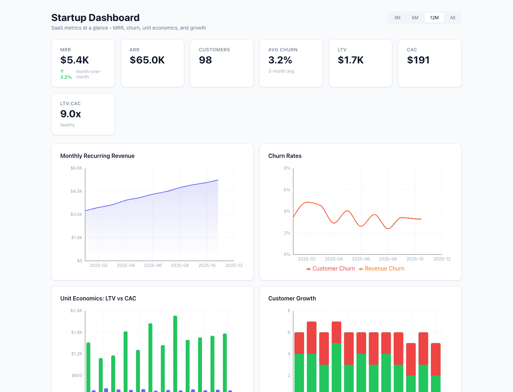

# startup-dashboard

A focused SaaS metrics dashboard for MRR, ARR, churn, LTV, CAC, payback, and
customer growth. Built with Next.js, TypeScript, and Recharts.



## Why This Exists

Early-stage teams need a clear view of unit economics before they buy a larger
analytics stack. This dashboard computes the metrics an operator, founder, or
investor will ask about from deterministic monthly data.

## What It Tracks

- MRR and ARR with growth trend context.
- Customer churn and revenue churn over time.
- CAC, LTV, CAC payback, and LTV:CAC ratio.
- New customers, churned customers, and net customer growth.
- Monthly detail rows for auditability.

## Getting Started

```bash
npm install
npm run dev
```

Open [http://localhost:3000](http://localhost:3000).

## Quality Checks

```bash
npm run typecheck
npm test
npm run build
```

Tests cover the metrics computation engine and deterministic seed data. Those
are the parts where correctness matters most.

## Architecture

```text
src/
  app/
    layout.tsx
    globals.css
    page.tsx
  components/
    Dashboard.tsx
    KPICard.tsx
    TimeRangeSelector.tsx
    MRRChart.tsx
    ChurnChart.tsx
    UnitEconomicsChart.tsx
    CustomerGrowthChart.tsx
    MetricsTable.tsx
  data/
    types.ts
    seed.ts
  hooks/
    useDashboard.ts
  utils/
    metrics.ts
```

## Metrics Definitions

| Metric | Formula |
|---|---|
| Customer churn rate | `churned_customers / previous_customers` |
| Revenue churn rate | `churned_revenue / previous_mrr` |
| CAC | `acquisition_spend / new_customers` |
| LTV | `arpu / monthly_churn_rate` |
| LTV:CAC ratio | `ltv / cac` |
| CAC payback | `cac / arpu` |
| MRR growth | `(current_mrr - previous_mrr) / previous_mrr` |

## Tech Stack

- Next.js 16
- React 18
- TypeScript strict mode
- Recharts
- Jest

## License

MIT. See [LICENSE](LICENSE).
